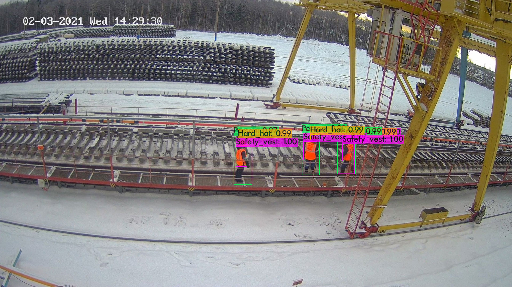

# ICVR_git

## Detection examples

	

	

## Test results

Safety vest, ap = 97.59%   	 (TP = 1956, FP = 510)  
Hard hat,    ap = 96.78%   	 (TP = 2001, FP = 64)  
Person,      ap = 99.86%   	 (TP = 2101, FP = 632)

For conf_thresh = 0.25, precision = 0.83, recall = 0.97, F1-score = 0.90  
For conf_thresh = 0.25, TP = 6058, FP = 1206, FN = 197, average IoU = 67.58 %  

IoU threshold = 50 %, used Area-Under-Curve for each unique Recall  
Mean average precision (mAP@0.50) = 0.980792, or 98.08 %
